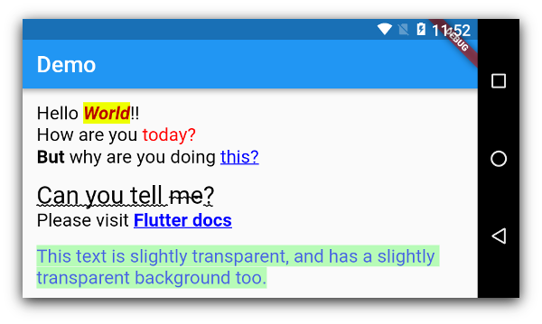

# CSS Text

This library makes it easy for you to convert HTML and CSS content into `RichText` widgets. It supports most CSS properties that are relevant to text content, except those related to text alignment.

Here's some sample HTML content:

```
<body><p style="font-size:1.5em;color:#99ff0011">Hello <b style="font-style:italic">World</b>!!<br/>
How are you <span style="font-family:RobotoBlack;color:#ff0000;background:#33eeff00">today?</span><br/>
<b>But</b> why are you doing <a href="https://google.com">this?</a><br/>
<br/>
<span style="text-decoration: underline solid; font-size:2em">Can you tell <del>me</del>?</span>
<br/>
Please visit <a style="font-weight:bold;" href="https://docs.flutter.io">Flutter docs</a></p></body>
```

This library can automatically convert all the HTML content above into a `TextSpan` object or a `RichText` widget. Here's what the rendered HTML will look like:



## Getting Started

Using `css_text` is extremely easy. First import the library in your Dart code:

```
import 'package:css_text/css_text.dart';
```

You can then create `RichText` widget from any HTML content by calling the `HTML.toTextSpan()` method.

```
String htmlContent = """<p style="font-size:1.5em;color:#99ff0011">Hello <b>World</b>""";
var myRichText = RichText(text: HTML.toTextSpan(context, htmlContent));
```

As a shortcut, you can also use the `HTML.toRichText()` method.

```
myRichText = HTML.toRichText(context, htmlContent);
```

## Handling Links

Your HTML content can have links. To handle them, you must use the `linksCallback` optional parameter.

```
String htmlContent = """<span style="font-size:2em">
Please click <a href="https://pub.dartlang.org">here</a> or 
<a href="https://old.reddit.com">here</a>.<br/>
<br/>
Go ahead! Try it.
</span>""";

var myRichText = HTML.toRichText(context, htmlContent, linksCallback: (link) {
    // You can now use the url_launcher to open the link in a browser. Or you can handle
    // the link in your app itself. This gives you complete control.
    // For now, let's just print it
    print(link);
});
```
